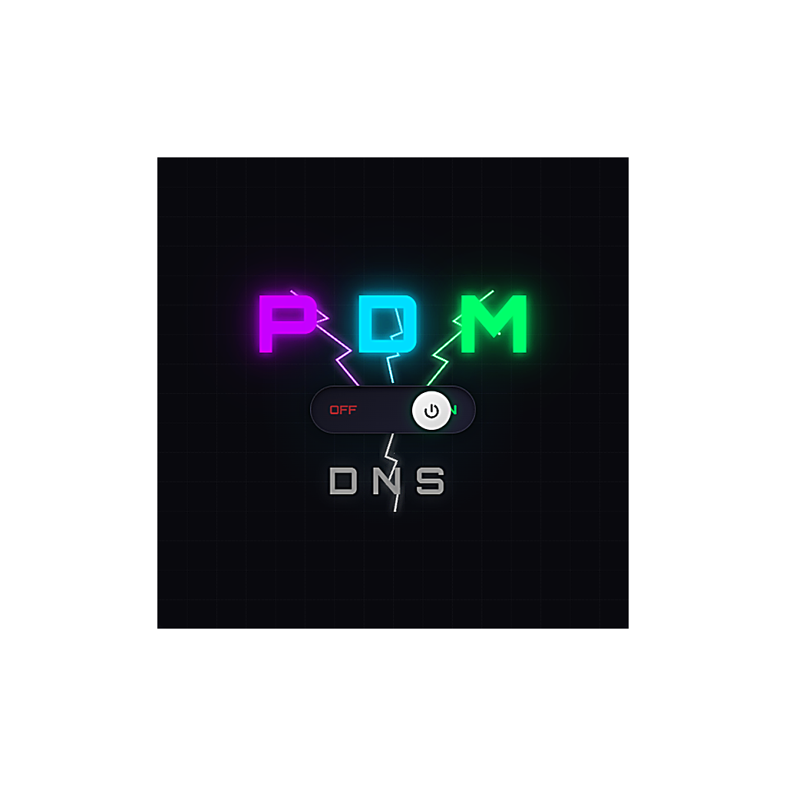

<div align="center">



# Perfect DNS Manager

**Free, open-source encrypted DNS manager for Android, Android TV, Fire TV and Formuler boxes.**

[](LICENSE)
[](https://github.com/appstorefr/PerfectDNSManager/releases/latest)
[](https://github.com/appstorefr/PerfectDNSManager/releases/latest)
[](#-internationalization)

[Website](https://pdm.appstorefr.net) ·
[Download APK](https://github.com/appstorefr/PerfectDNSManager/releases/latest/download/PerfectDNSManager-latest.apk) ·
[Privacy Policy](https://pdm.appstorefr.net/privacy) ·
[Releases](https://github.com/appstorefr/PerfectDNSManager/releases)

</div>

---

Perfect DNS Manager (PDM) is a TV-first, mobile-friendly DNS configuration tool that lets you route your device's DNS queries through encrypted protocols (DoH, DoT, DoQ) — without root, without ads, without telemetry.

## ✨ Features

### 🔐 Encrypted DNS
- **DoH** (DNS-over-HTTPS), **DoT** (DNS-over-TLS), **DoQ** (DNS-over-QUIC), plain DNS
- Pre-configured providers: Cloudflare, Quad9, NextDNS, ControlD, AdGuard, Mullvad, Surfshark, FDN, Yandex, and more
- Custom profiles supported

### 📊 Network testing
- **DNS Speedtest** — find the fastest provider near your location
- **Internet Speedtest** with 3 backends: Cloudflare · Netflix Fast.com · Ookla (server selectable with live ping)
- **Domain blocking tester** — compare ISP DNS vs alternative DNS providers, detect content blocking

### 📺 Android TV / Fire TV / Formuler optimized
- Full DPAD navigation, focus visible everywhere
- Native leanback launcher banner
- Native language selector activity (no AlertDialog)
- Differentiated layouts for mobile vs TV

### 🔗 Encrypted config sharing
- Share your DNS configuration via short link (AES-128 encrypted client-side)
- Encryption key never sent to server (URL fragment `#`)
- Configurable TTL + password protection

### 🌍 Internationalization
12 languages: **EN · FR · ES · DE · IT · PT-BR · RU · JA · ZH-CN · AR · HI · BN**

### 🛡️ Privacy
- **Zero telemetry, zero analytics, zero ads**
- 100% open source (GPL v3)
- Local-only settings (Android `SharedPreferences`)
- See [Privacy Policy](https://pdm.appstorefr.net/privacy)

## 📥 Installation

### Direct download
```
https://github.com/appstorefr/PerfectDNSManager/releases/latest/download/PerfectDNSManager-latest.apk
```

### Fire TV / Android TV (Downloader app)
Open the **Downloader** app and enter code **`9909387`**.

### Quick link (TV browsers)
```
pdm.appstorefr.net/apk
```

Compatible with **Android 5.0+** (API 21).

## 🏗️ Build from source

Requirements:
- JDK 17
- Android SDK with build-tools 34+
- A keystore for release signing

```bash
git clone https://github.com/appstorefr/PerfectDNSManager.git
cd PerfectDNSManager
./gradlew :app:assembleRelease
```

Release APK is produced under `app/build/outputs/apk/release/`.

For CI builds, the release pipeline is defined in [`.github/workflows/release.yml`](.github/workflows/release.yml).

## 📡 Backend infrastructure

The optional online features (IP/ISP detection, encrypted config sharing) are served by a Cloudflare Worker that lives at [pdm.appstorefr.net](https://pdm.appstorefr.net). Its source lives in a separate repo. Endpoints used:

- `GET /api/whoami` — returns public IP + ISP from Cloudflare edge metadata
- `GET /api/challenge` — ephemeral HMAC-SHA256 nonce (TTL 90s, IP-bound)
- `POST /api/upload` — accepts AES-128-encrypted blobs for config sharing
- `GET /r/:slug` — fetches encrypted blob (decryption happens in browser)

All sensitive operations are end-to-end encrypted; the worker never sees plaintext.

## 🌐 Sites

- Main landing & changelog: <https://pdm.appstorefr.net>
- Locale-specific pages: <https://appstorefr.github.io/PerfectDNSManager/>
- Direct APK redirect: <https://pdm.appstorefr.net/apk>
- Privacy: <https://pdm.appstorefr.net/privacy>

## 🤝 Contributing

Issues and PRs welcome.

For translation contributions, add or update strings in `app/src/main/res/values-<locale>/strings.xml`. Plurals in `<plurals>` blocks must respect the [CLDR rules](https://www.unicode.org/cldr/cldr-aux/charts/30/supplemental/language_plural_rules.html) for your locale.

For new features touching the VPN service, please open an issue first to discuss the approach.

## 📜 License

**GPL v3** — see [LICENSE](LICENSE).

This means: you can use it, modify it, distribute it, but if you redistribute a modified version, it must also be GPL v3 with source code available.

## 💖 Support

If you find PDM useful, you can support the project here:
👉 <https://appstorefr.github.io/PerfectDNSManager/support.html>

---

<div align="center">

**Perfect DNS Manager** © 2026 [AppstoreFR](mailto:appstorefr@ik.me)
Built with ❤️ for the open-source TV community.

</div>
